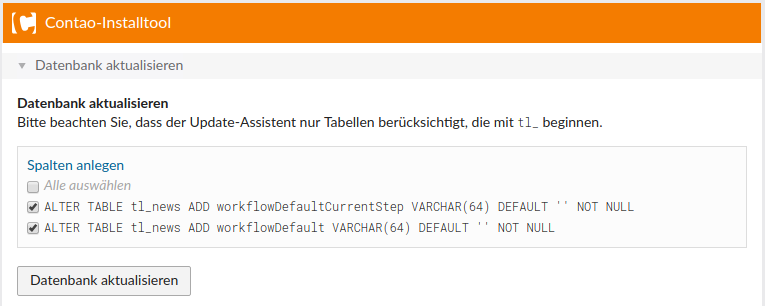
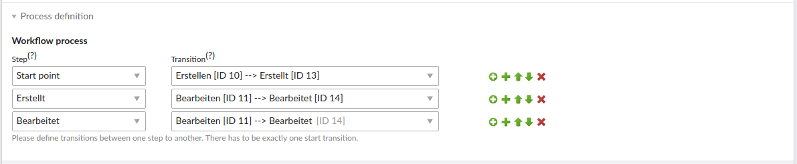

# Quick Start

Die Quick Start Anleitung zeigt exemplarisch anhand Für News (`tl_news`) wie man für eine beliebige DCA-basierte Tabelle den Standard-Workflow aktivieren kann.

## Installation

**netzmacht/contao-workflow** steht als Contao-Bundle zur Verfügung. Die Installation erfolgt über Composer/Contao 
Manager.

```bash
$ php composer.phar install netzmacht/contao-workflow:^2.0
```

## Konfiguration

**netzmacht/contao-workflow** erlaubt es beliebige *Workflowtypen* zu definieren und liefert einen generischen Workflowtyp *Default* mit.

Möchte man diesen für eine DCA-basierte Tabelle Tabelle aktivieren, ist eine Konfiguration in der `app/config/config.yml` notwendig. Mittels folgenden Konsolenbefehl erhält man eine Übersicht aller der möglichen Konfigurationsoptionen:
 
```bash
$ vendor/bin/contao-console config:dump-reference netzmacht_contao_workflow
```

Für `tl_news` sieht der Beitrag wie folgt aus:

```yaml
netzmacht_contao_workflow:
    default_type:
      tl_news:
        palettes: ['default']
        operation: first 
        submit_buttons: true
```

Damit die Konfiguration angewandt wird, muss der Cache neu aufgebaut werden:

```bash
$ vendor/bin/contao-console cache:warmup
```

## Install-Tool aufrufen

Nun lässt sich das Install-Tool aufrufen. Es müssen zwei neue Datenbankfelder angelegt werden:




## Workflow anlegen

Nun ist alles vorbereitet, sodass ein Workflow angelegt werden kann. Dazu sind folgende Schritte zu beachten:

1. Workflow anlegen
    - Typ *Default* auswählen 
    - Provider name *tl_news* auswählen
    - Der Prozess wird erst im Nachgang definiert
2. Actions definieren
    - Neue Action *Note* anlegen
3. Schritte definieren
    - Schritt Erstellt anlegen
    - Schritt Bearbeitet anlegen
4. Transitions definieren
    - Transition Erstellen anlegen 
        - Als Ziel den Schritt *Erstellt* auswählen
        - Transition aktivieren
    - Transition Bearbeiten anlegen
        - Als Ziel den Schritt *Bearbeitet* auswählen
        - Action *Notiz* auswählen
        - Transition aktivieren
5. Prozess definieren
    - Auf Workflow bearbeiten gehen
    - Prozess *Start point* =\>  *Erstellen* anlegen
    * Prozess *Erstellt*  =\>  *Bearbeiten* anlegen
    * Prozess *Bearbeitet*  =\>  *Bearbeiten* anlegen

Der Prozess ist nun angelegt und sollte wie folgt aussehen:




## Workflow zuweisen

Nun kann der Workflow beim Bearbeiten einer News ausgewählt werden. Dann der Konfiguration `submit_buttons: true` stehen
nun die Transitions als zusätzliche Submitbuttons zur Verfügung.
